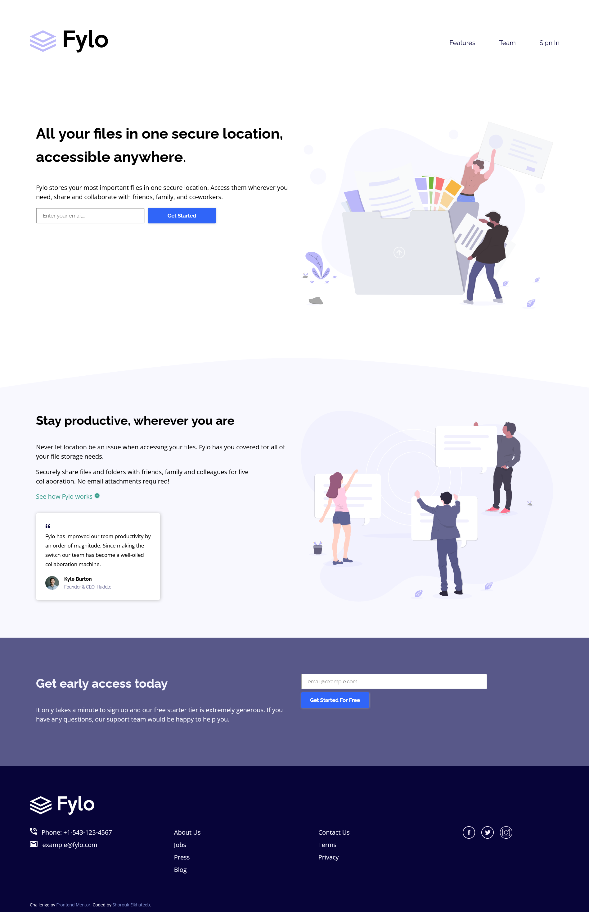

# Frontend Mentor - Fylo landing page with two column layout solution

This is a solution to the [Fylo landing page with two column layout challenge on Frontend Mentor](https://www.frontendmentor.io/challenges/fylo-landing-page-with-two-column-layout-5ca5ef041e82137ec91a50f5). Frontend Mentor challenges help you improve your coding skills by building realistic projects. 

## Table of contents

- [Overview](#overview)
  - [The challenge](#the-challenge)
  - [Screenshot](#screenshot)
  - [Links](#links)
- [My process](#my-process)
  - [Built with](#built-with)
  - [What I learned](#what-i-learned)
  - [Useful resources](#useful-resources)
- [Author](#author)

## Overview

### The challenge

Users should be able to:

- View the optimal layout for the site depending on their device's screen size
- See hover states for all interactive elements on the page

### Screenshot



### Links

- Solution URL: [https://github.com/shElkhateeb/fylo-landing-page-with-two-column-layout-master](https://github.com/shElkhateeb/fylo-landing-page-with-two-column-layout-master)
- Live Site URL: [https://shelkhateeb.github.io/fylo-landing-page-with-two-column-layout-master/](https://shelkhateeb.github.io/fylo-landing-page-with-two-column-layout-master/)

## My process

### Built with

- Semantic HTML5 markup
- CSS custom properties
- Flexbox

### What I learned

```css
.text-button input[type="email"]:invalid:not(:placeholder-shown) {
  outline: solid 2px hsla(0, 100%, 50%, 0.5);
  border: none;
  position: relative;
}
```

### Useful resources

- [Form Validation UX in HTML and CSS](https://css-tricks.com/form-validation-ux-html-css/) - This helped me for XYZ reason. I really liked this pattern and will use it going forward.

## Author

- Frontend Mentor - [@shElkhateeb](https://www.frontendmentor.io/profile/shElkhateeb)